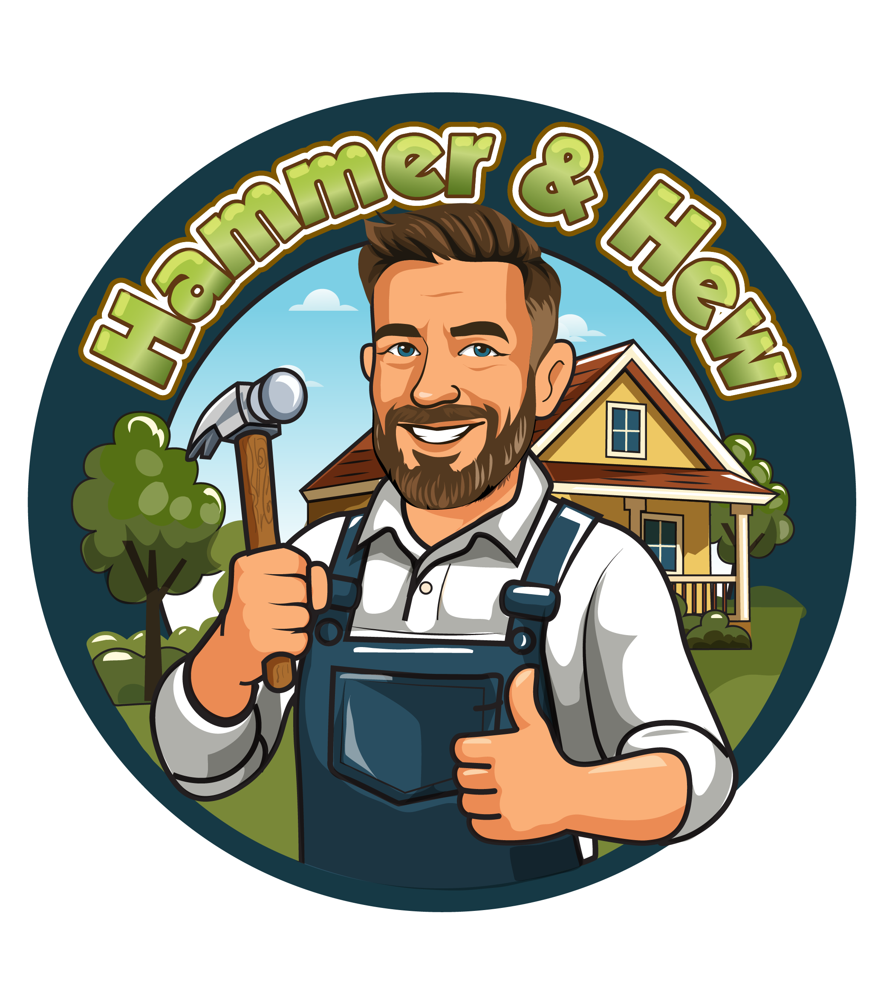

# Hammer & Hew LLC - Professional Deck Services Website



A high-converting lead generation website for **Hammer & Hew LLC**, a premium deck construction and restoration company serving Philadelphia, PA. Built with modern React stack and deployed live on Netlify with working contact forms.

## 🚀 Project Overview

**Hammer & Hew LLC** specializes in premium deck construction, restoration, staining, and custom design services in Philadelphia, PA. This website serves as the primary lead generation tool with working contact forms and Philadelphia-optimized SEO.

**Current Status**: 🟢 **LIVE IN PRODUCTION** - Deployed on Netlify with active Formspree integration

## ✨ Key Features

- **🎯 Lead Generation**: Working contact forms with live Formspree integration to hammerandhewllc@gmail.com
- **📱 Mobile-First**: Fully responsive design with enhanced mobile UX and adaptive layouts
- **🔍 SEO-Optimized**: Philadelphia-targeted keywords, local structured data, and semantic HTML
- **⚡ Performance**: Vite build optimization with fast loading times
- **🎨 Professional Design**: Modern emerald/slate/amber color scheme
- **📷 Real Content**: Authentic project photos and customer testimonials
- **♿ Accessible**: ARIA labels, keyboard navigation, and semantic structure

## 🛠️ Tech Stack

- **Frontend**: React 18 + TypeScript
- **Styling**: Tailwind CSS 3.4.15 (custom color palette)
- **Build Tool**: Vite 7.1.2
- **Forms**: React Hook Form + Zod validation
- **Animations**: Framer Motion
- **SEO**: React Helmet Async + structured data
- **Icons**: Lucide React
- **Forms Integration**: Formspree ready

## 🚀 Quick Start

### Prerequisites
- Node.js (v18 or higher)
- npm or yarn

### Installation

```bash
# Clone repository
git clone https://github.com/sa1to21/hammer-hew-website.git
cd hammer-hew-website

# Install dependencies (with legacy peer deps for React 19 compatibility)
npm install --legacy-peer-deps

# Start development server
npm run dev  # Usually runs on http://localhost:5174

# Build for production
npm run build

# Preview production build
npm run preview

# Run linter
npm run lint
```

## 📁 Project Structure

```
hammer-hew-website/
├── public/
│   ├── logo.png                           # Company logo
│   └── images/
│       ├── hero/main.jpg                  # Hero background
│       └── gallery/                       # Real project photos
│           ├── new-construction/
│           │   ├── new-001.jpg
│           │   └── new-002.jpg
│           └── restoration/
│               ├── restoration-001.jpg
│               ├── restoration-002.jpg
│               ├── restoration-003.jpg
│               └── restoration-004.jpg
├── src/
│   ├── components/
│   │   ├── layout/
│   │   │   ├── Header.tsx               # Dynamic floating navigation
│   │   │   ├── Footer.tsx               # Contact info & trust elements
│   │   │   └── Layout.tsx               # Main page wrapper
│   │   ├── sections/
│   │   │   ├── Hero.tsx                 # Centered hero with expanded container
│   │   │   ├── WhyChooseUs.tsx          # 5 key benefits + gradient background
│   │   │   ├── Gallery.tsx              # 6 real project photos, clean white bg
│   │   │   ├── Testimonials.tsx         # Customer reviews + gradient background
│   │   │   ├── ServicesProcessTabs.tsx  # Combined Services+Process, white bg
│   │   │   └── Contact.tsx              # Main contact form + gradient background
│   │   ├── ui/
│   │   │   ├── MainContactForm.tsx      # Primary lead capture form
│   │   │   ├── ServiceCard.tsx          # Compact service cards
│   │   │   ├── TestimonialCarousel.tsx  # Customer testimonials
│   │   │   └── AnimatedCounter.tsx      # Statistics animations
│   │   └── common/
│   │       ├── SEO.tsx                  # Meta tags & structured data
│   │       └── HelmetProvider.tsx
│   ├── utils/
│   │   ├── formConfig.ts                # Formspree integration
│   │   └── lazyLoading.ts               # Component lazy loading
│   └── App.tsx                          # Main app with sections
├── CLAUDE.md                             # Development guidelines
├── FORMSPREE_SETUP.md                    # Email integration setup
├── development_plan.md                   # Development history
└── README.md                             # This file
```

## 🎨 Design System

### Color Palette
- **Primary Emerald**: `emerald-600` (#059669) - Icons, CTAs, accents
- **Primary Slate**: `slate-800` (#1e293b) - CTA cards, navigation text
- **Secondary Amber**: `amber-600` (#d97706) - Popular badges, step numbers
- **Text**: `slate-700` (#334155) - Primary text, navigation
- **Background Gradients**: `from-green-50 via-white to-amber-50` - Featured sections
- **Background White**: `white` - Standard sections for contrast

### Typography
- **Headlines**: Merriweather (Google Fonts) - `font-heading` - Professional serif
- **Body Text**: Source Sans Pro (Google Fonts) - `font-body` - Clean readability
- **Font Weights**: Headlines 700, body text 400-600

### Component Classes
```css
.btn-primary    # Emerald CTA button with hover effects
.btn-secondary  # Outlined button that fills on hover
```

## 🗺️ Site Structure

**Section Flow:**
```
Hero → Why Choose Us → Gallery → Reviews → Services & Process → Contact
```

### Page Sections

1. **Hero**: Adaptive CTA positioning - mobile-first (button above badges) vs desktop layout
2. **Why Choose Us**: 5 key benefits with gradient background for visual appeal
3. **Gallery**: 6 real project photos with simplified clean layout (no filtering)
4. **Testimonials**: Customer reviews with gradient background and trust badges
5. **Services & Process**: Tabbed interface with clean white background
6. **Contact**: Mobile-first layout with form prioritized above contact info

## 📋 Services Offered

- **New Deck Construction**: Custom decks with premium materials and 10-year structural warranty
- **Deck Restoration**: Complete restoration services bringing new life to weathered decking
- **Staining & Sealing**: Premium finishes that enhance natural wood beauty with 3-year warranty  
- **Custom Design**: 3D design and consultation services with site measurement and analysis

## 📧 Form Integration

The website is ready for Formspree integration for handling contact form submissions:

1. Follow instructions in `FORMSPREE_SETUP.md`
2. Update `src/utils/formConfig.ts` with your endpoint
3. Forms will automatically send notifications to specified email

## 🚀 Deployment

### Build Commands
```bash
# Production build
npm run build

# Preview build locally
npm run preview
```

### Deployment Platforms
- **Netlify**: Drag and drop `dist` folder
- **Vercel**: Connect GitHub repository
- **GitHub Pages**: Use GitHub Actions workflow

### Environment Variables
```env
# For Formspree integration
VITE_FORMSPREE_ENDPOINT=your_formspree_endpoint_here
```

## 📈 SEO Features

- Local business structured data (JSON-LD)
- Optimized meta tags and Open Graph
- Semantic HTML structure
- Image alt text and descriptions
- Fast loading times (Vite optimization)

## 🔧 Development

### Available Scripts
- `npm run dev` - Start development server
- `npm run build` - Build for production  
- `npm run preview` - Preview production build
- `npm run lint` - Run ESLint

### Code Style
- TypeScript for type safety
- Component-based architecture
- Tailwind CSS for styling
- ESLint + Prettier for code formatting

## 📄 Documentation

- **CLAUDE.md**: Development guidelines and project overview
- **FORMSPREE_SETUP.md**: Email integration instructions
- **development_plan.md**: Complete development history and roadmap

## 📞 Contact Information

**Hammer & Hew LLC**  
📧 Email: hammerandhewllc@gmail.com  
📱 Phone: (917) 250-2222  
🌐 Website: [hammerhew.com](https://hammerhew.com)  
📍 Service Area: Philadelphia, PA

## 📜 License

This project is proprietary and confidential. All rights reserved to Hammer & Hew.

---

**Latest Updates** (ЭТАП 9 - SEO & Documentation Enhancement):
- ✅ **SEO Foundation**: Updated sitemap.xml with Philadelphia targeting and current site structure
- ✅ **Robots.txt Optimization**: Enhanced crawler rules, security blocks, and business branding
- ✅ **Alt Text SEO Enhancement**: Comprehensive image alt text optimization for search visibility
- ✅ **Footer Business Focus**: Replaced legal links with local business credibility markers
- ✅ **URL Structure Validation**: Confirmed optimal anchor navigation for SEO and user experience
- ✅ **Documentation Update**: Complete project documentation refresh with latest development stages

**Previous Updates** (ЭТАП 7 - Mobile UX Enhancement):
- ✅ **Adaptive Hero Layout**: CTA button positioning - mobile-first vs desktop
- ✅ **Mobile Navigation Overhaul**: Enhanced mobile menu with hover effects and better spacing
- ✅ **Trust Badges Optimization**: Column layout on mobile, horizontal on desktop
- ✅ **Contact Form Enhancement**: Mobile-first approach with form prioritized above contact info
- ✅ **Typography Responsiveness**: Comprehensive text sizing optimization across breakpoints
- ✅ **Touch-Friendly Interface**: Improved button sizes and spacing for mobile interaction

**Status**: ✅ Production Ready - SEO-optimized with comprehensive local business positioning
